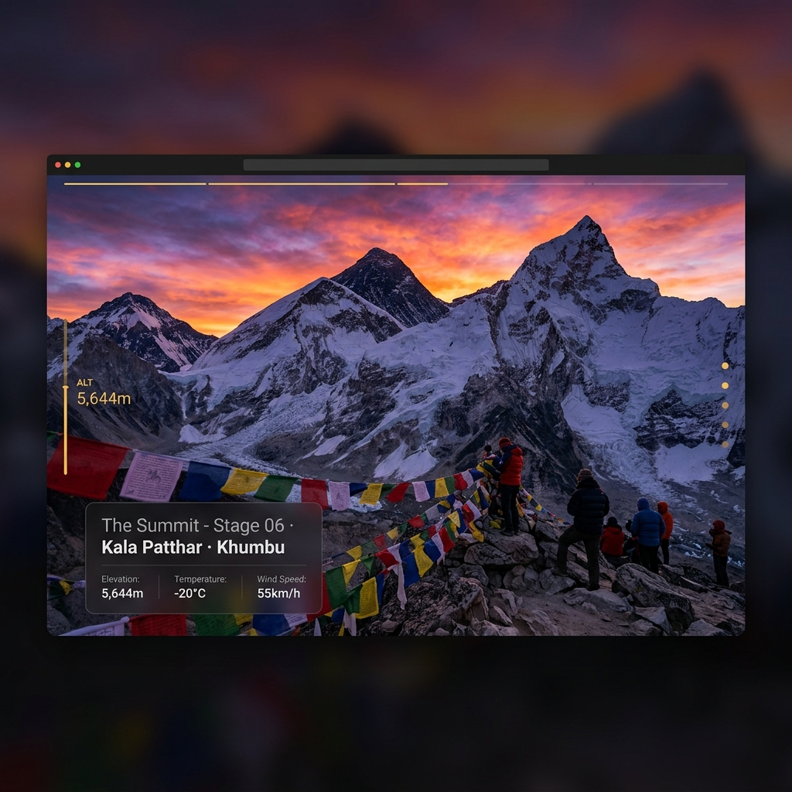

# 🏔️ Everest Base Camp Trek — Parallax Scrolling Webpage

An immersive, award-winning parallax scrolling experience that takes you through **six stages** of the Everest Base Camp Trek in Nepal's Khumbu Valley.



---

## ✨ Features

- **True photo parallax** — six photorealistic Himalayan scene photos, each moving at a different speed from the foreground card, creating genuine depth
- **Live altitude HUD** — amber tracker on the left counts from 2,860 m to 5,644 m as you scroll
- **Smooth 60 fps animations** — all scroll updates run in a single `requestAnimationFrame` loop; only compositor-layer `transform` properties are written
- **Glassmorphism info cards** — `backdrop-filter` blur panels with scene-specific light/dark variants
- **Section navigation dots** — fixed right-side dots powered by `IntersectionObserver`
- **Star canvas hero** — animated star-field on the intro screen; paused when off-screen
- **Cursor glow** — radial gradient that lazily follows the mouse (hover devices only)
- **Fully responsive** — fluid `clamp()` typography, 3-tier mobile breakpoints
- **Accessible** — `prefers-reduced-motion` respected, `aria-*` on all interactive elements

---

## 🗺️ The Six Stages

| Stage | Location | Altitude |
|-------|----------|----------|
| 01 | Khumbu Valley Forest · Phakding | 2,860 m |
| 02 | Dudh Kosi Canyon · Namche Bazaar | 3,440 m |
| 03 | Tengboche · Ama Dablam | 3,867 m |
| 04 | Lobuche · Khumbu Glacier Moraine | 4,940 m |
| 05 | Everest Base Camp · Night | 5,364 m |
| 06 | Kala Patthar · Sunrise | 5,644 m |

---

## 🛠️ Tech Stack

| Layer | Technology |
|-------|-----------|
| Structure | Semantic HTML5 |
| Styling | Vanilla CSS — `clamp()`, `backdrop-filter`, CSS custom properties |
| Animations | Vanilla JS — `requestAnimationFrame`, `IntersectionObserver`, `ResizeObserver` |
| Fonts | Google Fonts — Fraunces (display), Inter (body), DM Mono (mono) |
| Images | AI-generated photorealistic Himalayan scenes |
| Hosting | GitHub Pages |

No frameworks. No build step. No dependencies. The best technology depends on the problem — for a static, animation-heavy display site, vanilla JS keeps the bundle minimal and the scroll loop direct.

---

## ⚙️ How the Parallax Works

Each scene has a background photo layer that overflows the section by 15% top and bottom, giving it extra height to travel within. On every scroll event, a single `requestAnimationFrame` call reads all six sections' positions via `getBoundingClientRect()` in one batch, then writes a `translate3d(0, offset, 0)` transform to each photo layer — where `offset = -top × speed`.

The `speed` value decreases with each section to mirror the slower pace of real high-altitude trekking:

| Scene | Speed | Rationale |
|-------|-------|-----------|
| Forest | 0.25 | Low altitude — fast, lush, energetic |
| Canyon | 0.22 | |
| Tengboche | 0.20 | |
| Moraine | 0.18 | |
| Base Camp | 0.15 | |
| Kala Patthar | 0.12 | High altitude — slow, thin air, deliberate |

The foreground info card sits in normal document flow and does not move. The speed difference between card and photo is what the eye perceives as depth.

---

## 🏎️ Performance

- **Batch reads before writes** — all `getBoundingClientRect()` calls happen before any `style` writes per frame, preventing layout thrash
- **Compositor-only transforms** — `translate3d` and `scaleX` keep animations on the GPU thread; no `top`, `left`, or `height` changes trigger repaints in the scroll loop
- **`will-change: transform`** on photo layers — promotes them to compositor layers ahead of time
- **RAF throttle** — one DOM update per animation frame maximum, regardless of scroll event frequency
- **`IntersectionObserver`** for content reveals and nav dots — no scroll-listener overhead for these
- **`ResizeObserver`** on `document.documentElement` — recalculates `maxScroll` whenever the page height changes (e.g. after lazy images finish loading), fixing a bug where the altitude HUD would freeze at 2,860 m
- **`loading="lazy"` + `decoding="async"`** on all scene images except the first
- **`<link rel="preload">`** + `loading="eager"` on the first scene photo to eliminate LCP delay

---

## 🚀 Run Locally

```bash
# Clone the repo
git clone https://github.com/Ayush-Codes-11/Mountain-Trek-parallax-scrolling-webpage.git
cd Mountain-Trek-parallax-scrolling-webpage

# Serve with Python (or any static server)
python -m http.server 8080
```

Then open **http://localhost:8080** in your browser.

---

## 📁 Project Structure

```
├── index.html          # Page structure — hero + 6 scene sections
├── css/
│   └── style.css       # Design tokens, parallax layout, cards, responsive
├── js/
│   └── main.js         # RAF scroll loop, altitude HUD, star canvas, nav dots
├── img/
│   ├── s1-forest.jpg   # Khumbu Valley rhododendron forest
│   ├── s2-canyon.jpg   # Dudh Kosi river gorge
│   ├── s3-tengboche.jpg# Ama Dablam alpine meadow
│   ├── s4-moraine.jpg  # Khumbu glacier moraine
│   ├── s5-night.jpg    # Everest Base Camp night sky
│   └── s6-sunrise.jpg  # Kala Patthar sunrise
└── screenshots/
    └── preview.png
```

---

## 🔭 Planned Improvements

- Convert scene photos to **WebP** for ~50% smaller file sizes
- **Preloader screen** while photos fetch on slow connections
- **Ambient audio** per stage (forest birds, wind, glacier creak) fading between scenes
- **Interactive topographic map** with a live position marker tracking current scroll position
- **Keyboard navigation** — Tab through sections, Enter to activate nav dots
- **Open Graph metadata** for rich link previews when the URL is shared

---

## 🔗 Live Demo

> **[https://ayush-codes-11.github.io/Mountain-Trek-parallax-scrolling-webpage/](https://ayush-codes-11.github.io/Mountain-Trek-parallax-scrolling-webpage/)**

---

*Inspired by the Everest Base Camp Trek, Khumbu Valley, Nepal.*
